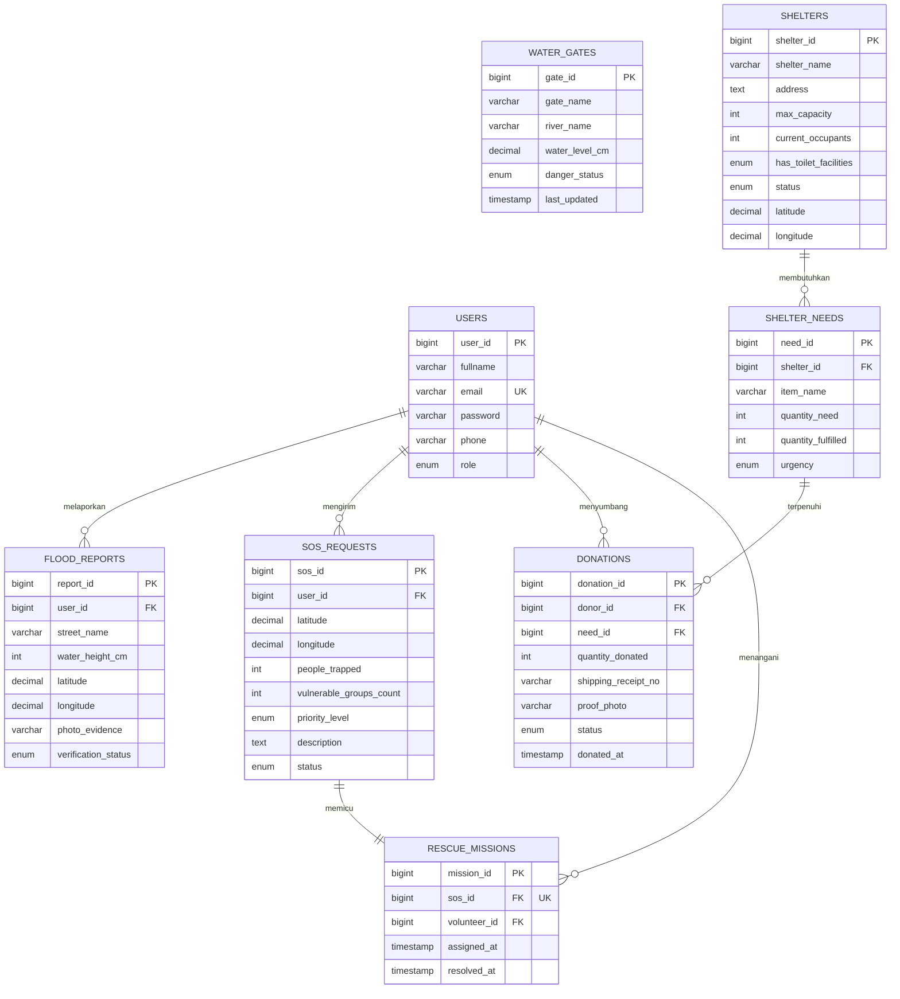

# 📊 LRS Database Diagram Code - TitikAman

Dokumen ini berisi kode untuk merepresentasikan struktur database (Logical Record Structure - LRS) **TitikAman**. Anda dapat menggunakan kode di bawah ini pada tool visualisasi database seperti **dbdiagram.io** atau **Mermaid**.

---

## 1. DBML (Database Markup Language)
*Cocok untuk di-copy paste ke situs [dbdiagram.io](https://dbdiagram.io/) untuk menghasilkan diagram LRS interaktif yang rapi secara otomatis.*

```dbml
// --- TABEL 1: USERS ---
Table users {
  user_id bigint [pk, increment]
  fullname varchar(100) [not null]
  email varchar(100) [unique, not null]
  password varchar(250) [not null]
  phone varchar(20) [not null]
  role enum [not null, note: "Warga, Relawan, Pengelola_Posko, Admin_BPBD"]
  remember_token varchar(100)
  created_at timestamp
  updated_at timestamp
}

// --- TABEL 2: WATER GATES ---
Table water_gates {
  gate_id bigint [pk, increment]
  gate_name varchar(100) [not null]
  river_name varchar(100) [not null]
  water_level_cm decimal(5,2) [not null]
  danger_status enum [not null, note: "Normal, Siaga_3, Siaga_2, Siaga_1"]
  last_updated timestamp [default: `CURRENT_TIMESTAMP`]
  created_at timestamp
  updated_at timestamp
}

// --- TABEL 3: FLOOD REPORTS ---
Table flood_reports {
  report_id bigint [pk, increment]
  user_id bigint [not null]
  street_name varchar(255) [not null]
  water_height_cm int [not null]
  latitude decimal(18,8) [not null]
  longitude decimal(11,8) [not null]
  photo_evidence varchar(255)
  verification_status enum [default: "pending", note: "pending, verified, rejected"]
  created_at timestamp [default: `CURRENT_TIMESTAMP`]
  updated_at timestamp
}

// --- TABEL 4: SHELTERS ---
Table shelters {
  shelter_id bigint [pk, increment]
  shelter_name varchar(100) [not null]
  address text [not null]
  max_capacity int [not null]
  current_occupants int [default: 0]
  has_toilet_facilities enum [default: "Yes", note: "Yes, No"]
  status enum [default: "active", note: "active, full, closed"]
  latitude decimal(10,8) [not null]
  longitude decimal(11,8) [not null]
  created_at timestamp
  updated_at timestamp
}

// --- TABEL 5: SHELTER NEEDS ---
Table shelter_needs {
  need_id bigint [pk, increment]
  shelter_id bigint [not null]
  item_name varchar(100) [not null]
  quantity_need int [not null]
  quantity_fulfilled int [default: 0]
  urgency enum [not null, note: "low, medium, high"]
  created_at timestamp
  updated_at timestamp
}

// --- TABEL 6: DONATIONS ---
Table donations {
  donation_id bigint [pk, increment]
  donor_id bigint [not null]
  need_id bigint [not null]
  quantity_donated int [not null]
  shipping_receipt_no varchar(100)
  proof_photo varchar(255) [not null]
  status enum [default: "pending", note: "pending, accepted, delivered"]
  donated_at timestamp [default: `CURRENT_TIMESTAMP`]
  created_at timestamp
  updated_at timestamp
}

// --- TABEL 7: SOS REQUEST ---
Table sos_requests {
  sos_id bigint [pk, increment]
  user_id bigint [not null]
  latitude decimal(18,8) [not null]
  longitude decimal(11,8) [not null]
  people_trapped int [not null]
  vulnerable_groups_count int [default: 0]
  priority_level enum [default: "low", note: "low, medium, high"]
  description text
  status enum [default: "waiting", note: "waiting, assigned, rescued, completed"]
  created_at timestamp [default: `CURRENT_TIMESTAMP`]
  updated_at timestamp
}

// --- TABEL 8: RESCUE MISSIONS ---
Table rescue_missions {
  mission_id bigint [pk, increment]
  sos_id bigint [unique, not null]
  volunteer_id bigint [not null]
  assigned_at timestamp [default: `CURRENT_TIMESTAMP`]
  resolved_at timestamp
  created_at timestamp
  updated_at timestamp
}

// --- RELASI (FOREIGN KEY) ---
Ref: flood_reports.user_id > users.user_id [delete: cascade]
Ref: shelter_needs.shelter_id > shelters.shelter_id [delete: cascade]
Ref: donations.donor_id > users.user_id [delete: cascade]
Ref: donations.need_id > shelter_needs.need_id [delete: cascade]
Ref: sos_requests.user_id > users.user_id [delete: cascade]
Ref: rescue_missions.sos_id - sos_requests.sos_id [delete: cascade] // 1-to-1 Relation
Ref: rescue_missions.volunteer_id > users.user_id [delete: cascade]
```

---

## 2. Mermaid ER Diagram
*Dapat dirender langsung di editor Markdown (seperti VS Code, GitHub, atau situs [mermaid.live](https://mermaid.live/)).*


