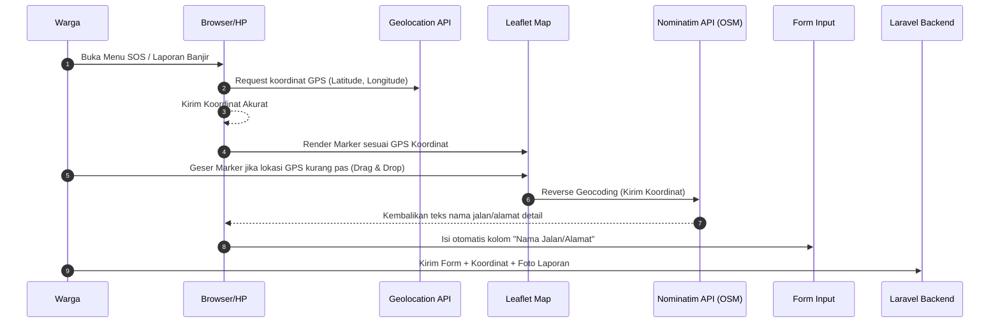

# Analisis Kebutuhan Peta & Library Pendukung - TitikAman

Untuk mengimplementasikan fitur-fitur pemetaan, koordinasi relawan, dan peringatan dini secara optimal di platform TitikAman, berikut adalah analisis mengenai teknologi peta (Map engine) dan library pendukung yang direkomendasikan.

---

## 🗺️ 1. Analisis Teknologi Peta (Map Engine)

TitikAman membutuhkan peta interaktif untuk menampilkan **Peta Genangan Banjir (Crowdsourcing)**, **Lokasi Korban SOS**, dan **Lokasi Posko Pengungsian (Shelter)**.

Berikut perbandingan opsi teknologi peta:

| Kriteria | Leaflet.js + OpenStreetMap (Rekomendasi Utama) | Mapbox GL JS | Google Maps API |
| :--- | :--- | :--- | :--- |
| **Biaya** | **100% Gratis & Open Source** | Gratis s.d 50.000 load/bulan (Butuh kartu kredit untuk pendaftaran) | Gratis kredit $200/bulan (Butuh kartu kredit wajib) |
| **Kebutuhan Lisensi** | Tidak butuh API Key / lisensi khusus. | Butuh API Access Token. | Butuh Google Cloud API Key. |
| **Performa Mobile** | Sangat ringan (hanya ~40KB JS), cocok untuk HP warga saat banjir. | Sedikit lebih berat karena render berbasis Vector. | Standar, loading aset cukup banyak. |
| **Kustomisasi Visual** | Bisa menggunakan custom map tiles (CartoDB, MapTiler, dll). | Sangat estetik, visual 3D, kustomisasi penuh. | Terbatas pada gaya bawaan Google Maps. |

### Rekomendasi untuk TitikAman: **Leaflet.js + OpenStreetMap (OSM)**
* **Alasan**: Sebagai aplikasi kebencanaan sosial, penggunaan Leaflet.js menjamin sistem dapat diakses secara gratis selamanya tanpa khawatir tagihan API yang membengkak saat traffic melonjak tinggi saat bencana banjir terjadi. Leaflet juga sangat stabil dan responsif di browser HP dengan jaringan internet terbatas.
* **Gaya Visual Premium**: Untuk menghindari tampilan visual OSM bawaan yang terkesan kuno, kita bisa mengganti map tiles-nya dengan tile gratisan dari **CartoDB Voyager** atau **CartoDB Positron (Dark Mode)** yang terlihat sangat modern, bersih, dan premium.

---

## 📦 2. Library Pendukung & Stack Integrasi

Berikut adalah daftar library pendukung yang dikelompokkan berdasarkan fungsinya untuk mendukung Backend (Laravel 12) dan Frontend.

### A. Library Pemetaan & Geospasial
* **Frontend**:
  * `leaflet`: Library inti pemetaan.
  * `react-leaflet` (Jika frontend menggunakan React/Inertia): Wrapper React resmi untuk Leaflet agar map bisa dirender sebagai komponen React yang reaktif.
  * `leaflet-geosearch` atau Nominatim API: Untuk fitur pencarian alamat (geocoding) dan mendeteksi nama jalan otomatis dari titik GPS (reverse geocoding) saat pelapor mengirim data banjir.
* **Backend (Laravel)**:
  * **Haversine Formula (Query Builder)**: Tidak memerlukan package tambahan untuk pencarian posko terdekat. Cukup menggunakan query matematika jarak (Haversine) langsung di database MySQL/MariaDB menggunakan lintang (`latitude`) dan bujur (`longitude`).
  * `geotools-php` (Opsional): Jika ingin melakukan kalkulasi jarak geografis yang lebih kompleks di sisi backend.

### B. Real-Time & Notifikasi (Penting untuk SOS & Tinggi Air)
Ketika status pintu air berubah menjadi Siaga 1 atau ada laporan SOS masuk, notifikasi harus dikirim secara instan tanpa reload halaman.
* **Laravel Reverb** (Bawaan Laravel 12): WebSocket server native Laravel yang sangat cepat, gratis, dan tidak membutuhkan layanan pihak ketiga.
* **Laravel Echo** (Frontend JS Library): Untuk mendengarkan (*listen*) event real-time dari Laravel Reverb di sisi frontend web (misal: memunculkan pin merah baru di peta ketika laporan terverifikasi oleh admin).
* **Firebase Cloud Messaging (FCM)**: Digunakan jika aplikasi ingin mengirimkan *Push Notification* langsung ke HP warga bahkan ketika browser mereka sedang ditutup.

### C. Pemrosesan Media (Foto Bukti Banjir & Donasi)
Laporan banjir warga mewajibkan unggah foto sebagai bukti agar tidak terjadi hoax.
* **Intervention Image** (`intervention/image`): Library PHP terbaik untuk mengompres, mengubah ukuran (resize), dan memformat foto bukti yang diunggah warga sebelum disimpan ke storage. Ini penting untuk menghemat kuota penyimpanan server.

### D. Export Data & Laporan (Kebutuhan BPBD / Kelurahan)
Pihak kelurahan atau BPBD memerlukan export data laporan untuk arsip atau evaluasi penanganan bencana.
* **Laravel Excel** (`maatwebsite/excel`): Untuk mengunduh data posko pengungsian, penyaluran donasi, dan laporan SOS ke format Excel (.xlsx) atau CSV.
* **DomPDF** (`barryvdh/laravel-dompdf`): Untuk menghasilkan berkas cetak PDF seperti surat penugasan relawan, struk bukti donasi diterima, atau laporan berkala bencana.

---

## 🔄 3. Alur Teknis Penggunaan GPS dan Peta

1. **Akurasi GPS**: Aplikasi menggunakan native browser HTML5 Geolocation API (`navigator.geolocation.getCurrentPosition`) untuk mendapatkan koordinat seakurat mungkin.
2. **Penyempurnaan Lokasi**: Warga diberikan kemampuan menggeser pin marker di peta Leaflet secara manual jika akurasi GPS di HP-nya meleset karena cuaca buruk.
3. **Penyimpanan**: Koordinat disimpan di database dalam bentuk tipe data `Decimal` (seperti yang sudah kita buat di migrasi) agar kompatibel dengan semua jenis database (MySQL, PostgreSQL, SQLite).
