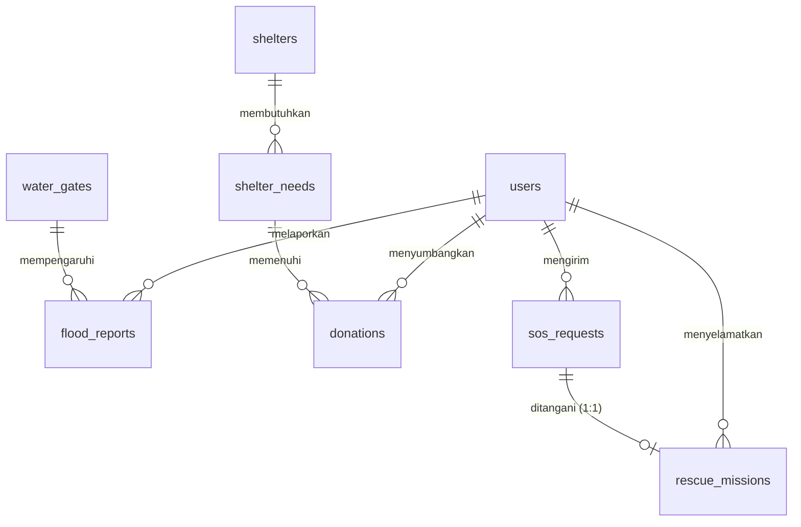

# 🗺️ Master Plan & Panduan AI-Assisted Developer - TitikAman

Dokumen ini adalah rencana komprehensif, panduan arsitektur, dan instruksi prompting AI untuk tim developer **TitikAman** (Sistem Mitigasi Banjir Kota Bekasi). Karena tim akan memanfaatkan AI dalam menulis kode, dokumen ini dirancang agar **langsung dipahami oleh developer manusia dan AI Coding Assistant** (seperti Gemini, Cursor, ChatGPT, atau Copilot).

---

## 👥 1. Struktur Tim & Pembagian Modul Kerja

Tim terdiri dari 5 orang. Karena anggota tim merupakan non-coder yang sepenuhnya menggunakan bantuan AI Coding Assistant untuk menghasilkan kode, pembagian peran difokuskan pada tanggung jawab pembuatan berkas tampilan halaman (Blade View Templates) beserta seluruh kode logika/database pendukungnya:

* **Darell (Lead Developer & PM)**: 
  - Penanggung jawab integrasi utama, review PR, dan **Fase 5 (Tampilan Portal Admin BPBD & Peringatan Dini TMA)**.
* **Innes (Developer 1 - Tampilan Autentikasi & Registrasi)**:
  - Penanggung jawab **Fase 1 (Tampilan Halaman Login, Pemilihan Peran, & Registrasi Warga)**.
* **Fatur (Developer 2 - Tampilan Portal Warga & Peta Laporan)**:
  - Penanggung jawab **Fase 2 (Tampilan Dashboard Warga, Peta Genangan Leaflet.js, & Form Laporan Banjir)**.
* **Januar (Developer 3 - Tampilan Portal Relawan & Misi Penyelamatan)**:
  - Penanggung jawab **Fase 3 (Tampilan Dashboard Relawan & WebSocket Notifikasi SOS)**.
* **Jeffry (Developer 4 - Tampilan Kelola Posko & Hub Donasi)**:
  - Penanggung jawab **Fase 4 (Tampilan Dashboard Pengelola Posko, Kebutuhan Logistik, & Halaman Donatur)**.

---

## 💾 2. Skema Database Terintegrasi (8 Tabel Utama + Alter Domisili)

Berdasarkan kesepakatan **Opsi A**, data domisili (`kecamatan` dan `kelurahan`) akan langsung disimpan ke dalam tabel `users` untuk mempermudah indexing dan query push notification peringatan dini.



### Kolom & Konvensi Tabel:
1. **`users`**: `user_id` (PK), `fullname`, `email` (nullable), `password`, `phone` (unique), `role` (enum: Warga, Relawan, Pengelola_Posko, Admin_BPBD), `kecamatan` (nullable), `kelurahan` (nullable), `timestamps`.
2. **`water_gates`**: `gate_id` (PK), `gate_name`, `river_name`, `water_level_cm`, `danger_status` (enum: Normal, Siaga_3, Siaga_2, Siaga_1), `last_updated`, `timestamps`.
3. **`flood_reports`**: `report_id` (PK), `user_id` (FK), `gate_id` (FK, nullable), `water_height_cm`, `street_name`, `latitude`, `longitude`, `photo_evidence` (nullable), `verification_status` (enum: pending, verified, rejected), `timestamps`, `soft_deletes`.
4. **`shelters`**: `shelter_id` (PK), `shelter_name`, `address`, `max_capacity`, `current_occupants`, `has_toilet_facilities` (enum: Yes, No), `status` (enum: active, full, closed), `latitude`, `longitude`, `timestamps`.
5. **`shelter_needs`**: `need_id` (PK), `shelter_id` (FK), `item_name`, `quantity_need`, `quantity_fulfilled`, `urgency` (enum: low, medium, high), `timestamps`.
6. **`donations`**: `donation_id` (PK), `donor_id` (FK), `need_id` (FK), `quantity_donated`, `shipping_receipt_no` (nullable), `proof_photo`, `status` (enum: pending, accepted, delivered), `donated_at`, `timestamps`, `soft_deletes`.
7. **`sos_requests`**: `sos_id` (PK), `user_id` (FK), `latitude`, `longitude`, `people_trapped`, `vulnerable_groups_count`, `priority_level` (enum: low, medium, high), `description` (nullable), `status` (enum: waiting, assigned, rescued, completed), `timestamps`, `soft_deletes`.
8. **`rescue_missions`**: `mission_id` (PK), `sos_id` (FK, unique), `volunteer_id` (FK), `assigned_at`, `resolved_at` (nullable), `timestamps`.

---

## 📅 3. Panduan Implementasi per Fase

Fase-fase di bawah ini menjelaskan alur pengembangan dan daftar fitur yang harus dibangun dari awal sampai selesai. Karena anggota tim merupakan non-coder yang pengerjaannya diserahkan kepada Lead Developer (Darell), **panduan detail di bawah ini berfungsi sebagai cetak biru sistem**. Hanya **Darell** (Lead Developer) yang akan menggunakan AI Prompt Master untuk mengintegrasikan seluruh kode program.

---

### 🌐 Fase 1: Halaman Autentikasi & Registrasi (Blade & DB Alter)
*   **Penanggung Jawab**: Innes (Developer 1 - Tampilan Autentikasi & Registrasi)
*   **Sinkronisasi Figma**: Login (`211:271`), Register Step 1 (`82:156`), Register Warga (`82:329`)
*   **Aset Figma Lokal**: `logo-titikaman.png`, `watermark-shield.png`, `role-warga.svg`, `role-relawan.svg`, `role-pengelola.svg`, `role-admin.svg`, `input-email.svg`, `input-password.svg`, `eye-toggle.svg`, `arrow-right-submit.svg`, `bullet-check.svg`, `shield-security.svg`, `input-user.svg`, `input-phone.svg`, `info-verification.svg`, `chevron-down.svg`, `back-arrow.svg`, `next-arrow.svg`.
*   **Tugas & Komponen**:
    1. **Layout & Wrapper**: Mengonfigurasi `resources/views/layouts/app.blade.php` dengan stylesheet global murni.
    2. **Halaman Login**: Mendesain `auth/login.blade.php` untuk form login ganda (email atau nomor HP) sesuai Figma.
    3. **Halaman Pilih Peran**: Membuat `auth/register-step1.blade.php` untuk memilih peran user sebelum mendaftar.
    4. **Form Registrasi Warga**: Membuat `auth/register-step2-warga.blade.php` dengan field nama lengkap, nomor HP, password, domisili kecamatan, dan kelurahan.
    5. **Database Alter**: Menyiapkan file migrasi tambahan untuk menambahkan kolom string `kecamatan` dan `kelurahan` ke tabel `users`.
    6. **Auth Logic**: Menyiapkan controller `AuthController`, class `RegisterRequest`, dan rute web.php untuk otentikasi login, register, dan logout.

---

### 🗺️ Fase 2: Tampilan Portal Warga & Peta Evakuasi (Peta, Laporan Genangan, & Halaman SOS Khusus)
*   **Penanggung Jawab**: Fatur (Developer 2 - Tampilan Portal Warga & Peta Laporan)
*   **Sinkronisasi Figma**: Sinyal SOS (`190:2`), Form Lapor Banjir (`163:1375`), Peta Evakuasi (`174:2`)
*   **Daftar Halaman Portal Warga & All-Role**:
    1. **Dashboard Utama Warga** (`warga/dashboard.blade.php`): Peta interaktif Leaflet.js (basemap Voyager) menampilkan posko aktif, shelter pengungsian, dan laporan genangan terverifikasi.
    2. **Halaman SOS Warga** (`warga/sos.blade.php`): Halaman khusus 3 kolom:
        - Kolom Kiri: Deteksi lokasi GPS aktual (peta mini) + Warning Alert Box.
        - Kolom Tengah: Form evakuasi dengan tombol denyut SOS 2-detik press-and-hold + counter orang terjebak + grid seleksi kelompok rentan (lansia, ibu hamil, balita, disabilitas) + textarea keterangan.
        - Kolom Rapat: Timeline status penanganan SOS real-time (Terkirim -> Mencari Relawan -> Relawan Ditugaskan -> Dalam Perjalanan -> Selesai) + Direktori Kontak Darurat.
    3. **Form Lapor Banjir** (`warga/lapor-banjir.blade.php`): Form wizard multi-langkah (input lokasi/titik koordinat gps, tinggi air, kondisi jalan, kelistrikan, air naik/tidak, dan upload bukti foto).
    4. **Peta Evakuasi & Shelter Interaktif** (All Roles / Public): Peta terintegrasi pada dashboard/landing page yang menunjukkan shelter terdekat, fasilitas toilet, rute evakuasi aman, dan kapasitas hunian shelter saat ini.
    5. **Landing Page Publik** (`welcome.blade.php`): Landing page terintegrasi untuk publik, menampilkan status darurat tingkat kota, statistik banjir aktif, dan tautan akses cepat (Lapor, SOS, Donasi, TMA).
*   **Backend & Servis**:
    - Skema tabel `sos_requests` dan `flood_reports`.
    - `SosService` (otomasi prioritas SOS berdasarkan kelompok rentan & jumlah orang terjebak) & `FloodReportService`.
    - AJAX endpoint untuk SOS submit dan routing portal warga di `routes/web.php` (prefix `/warga`).

---

### 🚨 Fase 3: Tampilan Portal Relawan (Misi Evakuasi & WebSocket Real-Time)
*   **Penanggung Jawab**: Januar (Developer 3 - Tampilan Portal Relawan & Misi Penyelamatan)
*   **Sinkronisasi Figma**: Dashboard Relawan (`163:2528`)
*   **Daftar Halaman**:
    1. **Dashboard Relawan** (`relawan/dashboard.blade.php`): Peta Leaflet pelacakan lokasi korban SOS (status waiting/assigned).
    2. **Misi Penyelamatan**: Antarmuka detail misi aktif dengan koordinat korban, status kelompok rentan, dan instruksi penanganan.
*   **Tugas & Komponen**:
    - Tombol AJAX "Terima Misi" dan "Evakuasi Selesai" untuk memperbarui status misi evakuasi di tabel `rescue_missions`.
    - Notifikasi Real-Time: Mengonfigurasi Laravel Reverb agar data SOS baru langsung di-broadcast ke dashboard relawan secara real-time via channel `disaster.{kecamatan_slug}`.
    - Backend Relawan: Event broadcast `SosDispatched`, repository/service untuk missions, dan backend controllers.

---

### 📦 Fase 4: Tampilan Kelola Posko & Hub Donasi (Logistik & Sanitasi)
*   **Penanggung Jawab**: Jeffry (Developer 4 - Tampilan Kelola Posko & Hub Donasi)
*   **Sinkronisasi Figma**: Kelola Kebutuhan (`163:2917`), Hub Donasi (`186:2`), Posko Pengungsian (`187:2`)
*   **Daftar Halaman**:
    1. **Dashboard Pengelola Posko** (`pengelola/dashboard.blade.php`): Kelola kapasitas pengungsi, status posko, toilet, dan pantau barang logistik kebutuhan posko.
    2. **Portal Hub Donasi Publik** (`donasi/hub.blade.php` - All Role / Public): Menampilkan daftar kebutuhan posko se-Bekasi secara real-time dan form donatur untuk sumbangan barang logistik (input item, jumlah barang, resi kirim, dan upload foto bukti kirim).
*   **Tugas & Komponen**:
    - Backend Logistik: Tabel `shelters`, `shelter_needs`, `donations`. Job background `CompressDonationImageJob` untuk kompres foto donasi.
    - Auto Update: Otomasi penambahan jumlah barang terverifikasi ke kolom `quantity_fulfilled` pada kebutuhan posko ketika donasi disetujui.

---

### 📊 Fase 5: Tampilan Portal Admin BPBD & Pemantauan Tinggi Air
*   **Penanggung Jawab**: Darell (Lead Developer & PM - Tampilan Portal Admin BPBD & Peringatan Dini TMA)
*   **Sinkronisasi Figma**: Kelola Laporan Admin (`163:2189`), Data Pintu Air (`163:3941`)
*   **Daftar Halaman**:
    1. **Dashboard Admin BPBD** (`admin/dashboard.blade.php`): Verifikasi/tolak laporan genangan banjir (pending, verified, rejected).
    2. **Informasi Tinggi Muka Air (TMA) & Pintu Air** (`pintu-air.blade.php` - All Role / Public): Halaman publik untuk memantau status siaga pintu air di kota Bekasi (Normal, Siaga 3, Siaga 2, Siaga 1) dilengkapi grafik tren TMA.
*   **Tugas & Komponen**:
    - Pemantauan TMA Pintu Air: Halaman input update tinggi muka air pintu air (tabel `water_gates`).
    - Peringatan Dini: Integrasi event/listener `TmaThresholdExceeded` yang men-dispatch background Job untuk SMS/push broadcast ke warga jika status sungai naik melewati ambang batas siaga.
    - Export Rekap: Fitur export rekapitulasi data genangan ke Excel/PDF menggunakan Laravel Queue.

---

## 🤖 Asisten Integrasi Master AI Prompt untuk Darell (Lead & PM)

Gunakan prompt master di bawah ini untuk memandu AI Coding Assistant Anda dalam mengintegrasikan, memverifikasi, dan melengkapi seluruh modul proyek yang diserahkan oleh tim:

> [!IMPORTANT]
> **🤖 Master AI Integration Prompt (Copy-Paste ke AI Coder Anda):**
> ```text
> Saya adalah Darell, Lead Developer & PM proyek TitikAman. Saya bertugas mengintegrasikan seluruh modul (Fase 1 sampai Fase 5) dari tim pengembang ke dalam repositori utama Laravel 12 kami dengan CSS murni (tanpa Tailwind/Breeze).
> Tolong bantu saya membangun dan mengintegrasikan seluruh berkas sistem dengan rincian berikut:
> 
> 1. INTEGRASI FASE 1 (Auth & User):
>    - Buat/jalankan migrasi alter tabel `users` untuk kolom `kecamatan` dan `kelurahan`.
>    - Buat `RegisterRequest` dan `AuthController` untuk menangani alur Login ganda (email/HP) dan Registrasi Warga.
>    - Hubungkan dengan view `layouts/app.blade.php`, `auth/login.blade.php`, `auth/register-step1.blade.php`, dan `auth/register-step2-warga.blade.php`.
> 
> 2. INTEGRASI FASE 2 (GIS & Laporan):
>    - Buat tabel `sos_requests` dan `flood_reports`.
>    - Buat `SosRepository`/`SosService` (hitung prioritas otomatis) dan `FloodReportRepository`/`FloodReportService` (upload foto bukti genangan maks 5MB).
>    - Hubungkan dengan view `warga/dashboard.blade.php` (peta Leaflet.js dengan marker genangan verified & posko aktif, tombol SOS) dan `warga/lapor-banjir.blade.php`.
> 
> 3. INTEGRASI FASE 3 (Relawan & WebSocket):
>    - Buat tabel `rescue_missions`.
>    - Buat `RescueMissionService` untuk menangani penerimaan misi evakuasi (ubah status SOS korban ke assigned/completed).
>    - Konfigurasikan Laravel Reverb & Event `SosDispatched` (ShouldBroadcast) ke channel `disaster.{kecamatan_slug}`.
>    - Hubungkan dengan view `relawan/dashboard.blade.php` (peta Leaflet.js posisi korban waiting & tombol AJAX terima/selesai misi).
> 
> 4. INTEGRASI FASE 4 (Posko & Donasi):
>    - Buat tabel `shelters`, `shelter_needs`, dan `donations`.
>    - Buat `ShelterService` & `DonationService`. Tambahkan background Queue Job `CompressDonationImageJob` untuk kompres gambar resi/bukti kirim.
>    - Buat logic otomasi: saat donasi disetujui (status delivered), sistem otomatis menambah kolom `quantity_fulfilled` pada tabel `shelter_needs` posko terkait.
>    - Hubungkan dengan view `pengelola/dashboard.blade.php` (kelola posko & kapasitas) dan `donasi/hub.blade.php` (portal donatur publik).
> 
> 5. INTEGRASI FASE 5 (Admin BPBD & TMA Alert):
>    - Buat fitur verifikasi laporan banjir warga (pending, verified, rejected).
>    - Buat form input TMA pintu air (`water_gates`). Saat TMA naik melewati batas siaga, trigger event `TmaThresholdExceeded` untuk mengirimkan simulasi alert ke warga berdomisili sama via background Queue Job.
>    - Buat fitur export rekapitulasi data banjir ke Excel/PDF menggunakan Laravel Queue.
>    - Amankan panel admin menggunakan Laravel Policy & Gate khusus role 'Admin_BPBD'.
>    - Hubungkan dengan view `admin/dashboard.blade.php` dan `admin/pintu-air.blade.php`.
> 
> Pastikan seluruh arsitektur kode menggunakan struktur Service-Repository yang modular, controller tetap tipis, dan database seeders/factories disiapkan untuk data testing awal. Hasilkan kode yang utuh dan bersih agar sistem terintegrasi dengan sempurna.
> ```

---

## 📈 4. Standar Kualitas & Aturan Penulisan Kode (AI-Assisted Rules)

Semua developer dan AI Coding Assistant wajib mematuhi aturan berikut selama menulis kode program:

1.  **Arsitektur Service-Repository & Clean Code**:
    - **Controller** hanya bertugas menerima request, memanggil service, dan mengembalikan view/response (thin controller).
    - **Service Class** mengolah logika bisnis (misal: perhitungan prioritas, upload file, trigger event).
    - **Repository Class** mengolah interaksi database (Eloquent query, update, create).
    - **Pemisahan File (Modularization)**: Kode wajib bersih (Clean Code) dan terstruktur. Jika file (Controller, Service, Helper, dll.) dirasa sudah terlalu panjang atau memiliki banyak tanggung jawab (*violating Single Responsibility Principle*), **WAJIB** pecah kode tersebut ke dalam file terpisah (seperti membuat Service baru, kustom repository, helper class, atau trait).
2.  **Validasi Input**:
    - Dilarang keras menggunakan `$request->validate()` di dalam controller.
    - Seluruh form input wajib menggunakan **Form Request** terpisah (di bawah folder `app/Http/Requests`).
3.  **Aset Ikon & Font**:
    - **Dilarang** menggunakan emoji sistem operasi (misal: 🚨, 📡). Gunakan Lucide/Heroicons atau aset SVG resmi dari Figma yang telah disimpan di folder `public/assets/`.
    - Gunakan Google Fonts (Inter, Plus Jakarta Sans, Poppins) dalam tag HTML.
4.  **Keamanan Otorisasi**:
    - Cek hak akses menggunakan **Laravel Policy & Gate**. Jangan melakukan cek manual hard-code role di controller (`if (auth()->user()->role === 'admin')`).
5.  **Pengujian Otomatis (Testing) & Kebijakan Git**:
    - Setiap fitur baru wajib dilengkapi dengan Feature/Unit Test yang memvalidasi database dan alur program.
    - **DILARANG KERAS** melakukan `git push` ke GitHub apabila pengujian (test suite) belum berhasil lolos sepenuhnya (*pass*). Jalankan pengujian secara lokal terlebih dahulu sebelum push.
6.  **Konvensi Pesan Commit**:
    - Setiap commit wajib mematuhi panduan pesan commit yang tertuang pada **[docs/COMMIT_CONVENTION.md](file:///d:/laragon/www/titikAman/docs/COMMIT_CONVENTION.md)**. Pastikan tipe dan scope ditulis secara konsisten.
