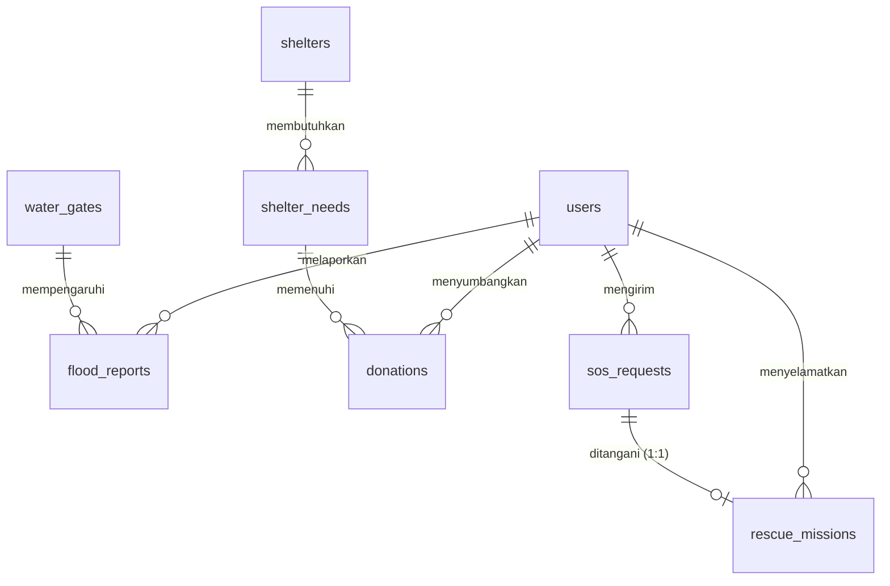

# 🗺️ Master Plan & Panduan AI-Assisted Developer - TitikAman

Dokumen ini adalah rencana komprehensif, panduan arsitektur, dan instruksi prompting AI untuk tim developer **TitikAman** (Sistem Mitigasi Banjir Kota Bekasi). Karena tim akan memanfaatkan AI dalam menulis kode, dokumen ini dirancang agar **langsung dipahami oleh developer manusia dan AI Coding Assistant** (seperti Gemini, Cursor, ChatGPT, atau Copilot).

---

## 👥 1. Struktur Tim & Pembagian Modul Kerja

Tim terdiri dari 5 orang. Karena anggota tim merupakan non-coder yang sepenuhnya menggunakan bantuan AI Coding Assistant untuk menghasilkan kode, pembagian peran difokuskan pada tanggung jawab pembuatan berkas tampilan halaman (Blade View Templates) beserta seluruh kode logika/database pendukungnya:

* **Darell (Lead Developer & PM)**: 
  - Penanggung jawab integrasi utama, review PR, dan **Fase 5 (Tampilan Portal Admin BPBD & Peringatan Dini TMA)**.
* **Innes (Developer 1 - Tampilan Autentikasi & Registrasi)**:
  - Penanggung jawab **Fase 1 (Tampilan Halaman Login, Pemilihan Peran, & Registrasi Warga)**.
* **Fatur (Developer 2 - Tampilan Portal Warga & Peta Laporan)**:
  - Penanggung jawab **Fase 2 (Tampilan Dashboard Warga, Peta Genangan Leaflet.js, & Form Laporan Banjir)**.
* **Januar (Developer 3 - Tampilan Portal Relawan & Misi Penyelamatan)**:
  - Penanggung jawab **Fase 3 (Tampilan Dashboard Relawan & WebSocket Notifikasi SOS)**.
* **Jeffry (Developer 4 - Tampilan Kelola Posko & Hub Donasi)**:
  - Penanggung jawab **Fase 4 (Tampilan Dashboard Pengelola Posko, Kebutuhan Logistik, & Halaman Donatur)**.

---

## 💾 2. Skema Database Terintegrasi (8 Tabel Utama + Alter Domisili)

Berdasarkan kesepakatan **Opsi A**, data domisili (`kecamatan` dan `kelurahan`) akan langsung disimpan ke dalam tabel `users` untuk mempermudah indexing dan query push notification peringatan dini.



### Kolom & Konvensi Tabel:
1. **`users`**: `user_id` (PK), `fullname`, `email` (nullable), `password`, `phone` (unique), `role` (enum: Warga, Relawan, Pengelola_Posko, Admin_BPBD), `kecamatan` (nullable), `kelurahan` (nullable), `timestamps`.
2. **`water_gates`**: `gate_id` (PK), `gate_name`, `river_name`, `water_level_cm`, `danger_status` (enum: Normal, Siaga_3, Siaga_2, Siaga_1), `last_updated`, `timestamps`.
3. **`flood_reports`**: `report_id` (PK), `user_id` (FK), `gate_id` (FK, nullable), `water_height_cm`, `street_name`, `latitude`, `longitude`, `photo_evidence` (nullable), `verification_status` (enum: pending, verified, rejected), `timestamps`, `soft_deletes`.
4. **`shelters`**: `shelter_id` (PK), `shelter_name`, `address`, `max_capacity`, `current_occupants`, `has_toilet_facilities` (enum: Yes, No), `status` (enum: active, full, closed), `latitude`, `longitude`, `timestamps`.
5. **`shelter_needs`**: `need_id` (PK), `shelter_id` (FK), `item_name`, `quantity_need`, `quantity_fulfilled`, `urgency` (enum: low, medium, high), `timestamps`.
6. **`donations`**: `donation_id` (PK), `donor_id` (FK), `need_id` (FK), `quantity_donated`, `shipping_receipt_no` (nullable), `proof_photo`, `status` (enum: pending, accepted, delivered), `donated_at`, `timestamps`, `soft_deletes`.
7. **`sos_requests`**: `sos_id` (PK), `user_id` (FK), `latitude`, `longitude`, `people_trapped`, `vulnerable_groups_count`, `priority_level` (enum: low, medium, high), `description` (nullable), `status` (enum: waiting, assigned, rescued, completed), `timestamps`, `soft_deletes`.
8. **`rescue_missions`**: `mission_id` (PK), `sos_id` (FK, unique), `volunteer_id` (FK), `assigned_at`, `resolved_at` (nullable), `timestamps`.

---

## 📅 3. Panduan Implementasi per Fase & AI Prompts

Setiap fase di bawah dilengkapi dengan **AI Prompt** khusus. Developer dapat menyalin prompt tersebut untuk diinput ke AI coding assistant mereka guna menghasilkan kode yang sesuai dengan standar p### 🌐 Fase 1: Halaman Autentikasi & Registrasi (Blade & DB Alter)
*   **Penanggung Jawab**: Innes (Developer 1 - Tampilan Autentikasi & Registrasi)
*   **Sinkronisasi Figma**: Login (`211:271`), Register Step 1 (`82:156`), Register Warga (`82:329`)
*   **Aset Figma Lokal**: `logo-titikaman.png`, `watermark-shield.png`, `role-warga.svg`, `role-relawan.svg`, `role-pengelola.svg`, `role-admin.svg`, `input-email.svg`, `input-password.svg`, `eye-toggle.svg`, `arrow-right-submit.svg`, `bullet-check.svg`, `shield-security.svg`, `input-user.svg`, `input-phone.svg`, `info-verification.svg`, `chevron-down.svg`, `back-arrow.svg`, `next-arrow.svg`.

> [!IMPORTANT]
> **🤖 AI Prompt untuk Innes (Developer 1 - Copy-Paste ke AI Coder Anda):**
> ```text
> Saya adalah Innes, Developer 1. Saya tidak bisa coding dan sedang membangun proyek Laravel 12 bernama TitikAman tanpa Laravel Breeze menggunakan CSS murni (tanpa Tailwind).
> Tolong buatkan seluruh file tampilan (Blade Views) beserta seluruh berkas controller, request, rute, dan migrasi database pendukung berikut secara lengkap agar saya tinggal menyimpannya dan langsung jalan:
> 1. File `resources/views/layouts/app.blade.php`: Halaman kerangka layout utama dengan styling CSS modern, premium, dan responsif.
> 2. File `resources/views/auth/login.blade.php` (Halaman Login - Figma Node 211:271): Tampilan form login ganda dengan input email atau nomor HP, password, tombol toggle tampilkan/sembunyikan password, dan desain premium sesuai aset figma yang disediakan di proyek.
> 3. File `resources/views/auth/register-step1.blade.php` (Halaman Pilih Peran - Figma Node 82:156): Pilihan opsi pendaftaran peran Warga, Relawan, Pengelola Posko, dan Admin BPBD dengan desain visual kartu grid yang intuitif.
> 4. File `resources/views/auth/register-step2-warga.blade.php` (Halaman Form Registrasi Warga - Figma Node 82:329): Formulir data diri warga lengkap dengan input Nama Lengkap, No. HP, Password, Kecamatan, Kelurahan, serta checkbox Persetujuan Syarat & Ketentuan.
> 5. Logika Backend Pendukung:
>    - Migration untuk menambah kolom string `kecamatan` dan `kelurahan` (nullable) ke tabel `users`.
>    - `app/Http/Requests/RegisterRequest.php` untuk validasi form registrasi warga.
>    - `AuthController` untuk menangani login ganda (email/HP), menampilkan view-view di atas, memproses registrasi warga, auto-login, dan logout.
>    - Rute web.php yang sesuai dengan middleware guest/auth.
> 
> Tuliskan kode untuk setiap file secara utuh dan lengkap agar saya tinggal menyalinnya langsung ke dalam folder proyek saya tanpa perlu menulis kode tambahan.
> ```

### 🗺️ Fase 2: Tampilan Portal Warga (Peta & Laporan Genangan)
*   **Penanggung Jawab**: Fatur (Developer 2 - Tampilan Portal Warga & Peta Laporan)
*   **Sinkronisasi Figma**: Sinyal SOS (`190:2`), Form Lapor Banjir (`163:1375`), Peta Evakuasi (`174:2`)

> [!IMPORTANT]
> **🤖 AI Prompt untuk Fatur (Developer 2 - Copy-Paste ke AI Coder Anda):**
> ```text
> Saya adalah Fatur, Developer 2. Saya tidak bisa coding dan sedang mengimplementasikan modul GIS Portal Warga di Laravel 12 menggunakan Leaflet.js dengan CSS murni (tanpa Tailwind).
> Tolong buatkan seluruh file tampilan (Blade Views) beserta controller, service, repository, dan rute pendukung berikut secara lengkap agar saya tinggal menyimpannya dan langsung jalan:
> 1. File `resources/views/warga/dashboard.blade.php` (Dashboard Warga - Figma Node 190:2 & 174:2): Berisi peta Leaflet.js dengan basemap 'CartoDB Voyager' yang memetakan marker laporan genangan terverifikasi (status verified) dan posko pengungsian aktif. Sediakan juga tombol mengambang merah mencolok "KIRIM SINYAL SOS".
> 2. File `resources/views/warga/lapor-banjir.blade.php` (Form Lapor Banjir - Figma Node 163:1375): Formulir untuk warga melaporkan banjir yang mencakup input tinggi air (cm), nama jalan, koordinat GPS (latitude/longitude otomatis didapat dari geolocation browser), dan upload foto bukti genangan (maksimal 5MB).
> 3. Logika Backend Pendukung:
>    - `SosRepository` & `SosService` untuk menyimpan sinyal SOS ke tabel `sos_requests` (prioritas high otomatis di-set jika ada kelompok rentan seperti lansia/balita/ibu hamil > 0, sisanya low).
>    - `FloodReportRepository` & `FloodReportService` untuk menyimpan laporan banjir beserta upload foto ke storage.
>    - Endpoint API/Controller untuk menyajikan data marker JSON (laporan banjir verified & posko pengungsian aktif) untuk ditampilkan di peta.
>    - Rute-rute di bawah prefix 'warga' dengan middleware auth di `routes/web.php`.
> 
> Tuliskan kode untuk setiap file secara utuh dan lengkap agar saya tinggal menyalinnya langsung ke dalam folder proyek saya tanpa perlu menulis kode tambahan.
> ```

### 🚨 Fase 3: Tampilan Portal Relawan (Misi Evakuasi & WebSocket Real-Time)
*   **Penanggung Jawab**: Januar (Developer 3 - Tampilan Portal Relawan & Misi Penyelamatan)
*   **Sinkronisasi Figma**: Dashboard Relawan (`163:2528`)

> [!IMPORTANT]
> **🤖 AI Prompt untuk Januar (Developer 3 - Copy-Paste ke AI Coder Anda):**
> ```text
> Saya adalah Januar, Developer 3. Saya tidak bisa coding dan sedang mengimplementasikan modul Relawan dan fitur Real-Time menggunakan Laravel Reverb dan WebSocket di Laravel 12 dengan CSS murni (tanpa Tailwind).
> Tolong buatkan seluruh file tampilan (Blade Views) beserta controller, service, event broadcast, dan rute pendukung berikut secara lengkap agar saya tinggal menyimpannya dan langsung jalan:
> 1. File `resources/views/relawan/dashboard.blade.php` (Dashboard Relawan - Figma Node 163:2528): Halaman yang menampilkan peta Leaflet.js berisi marker posisi koordinat SOS korban berstatus 'waiting' secara real-time. Sediakan tombol aksi "Terima Misi" dan "Evakuasi Selesai" di dalam pop-up marker atau panel navigasi samping.
> 2. Logika Real-Time & Backend Pendukung:
>    - Integrasikan Laravel Reverb. Buatkan Event `SosDispatched` yang mengimplementasikan `ShouldBroadcast` agar data SOS baru langsung dikirim secara real-time via WebSocket ke channel `disaster.{kecamatan_slug}`.
>    - Buat `RescueMissionService` & `RescueMissionRepository` untuk mengelola data di tabel `rescue_missions`. Saat relawan menerima misi, ubah status SOS korban menjadi 'assigned', dan ketika selesai ubah menjadi 'completed' dengan mengisi kolom `resolved_at`.
>    - Sediakan endpoint AJAX/Fetch API untuk memproses perubahan status tersebut secara asinkron tanpa reload halaman.
>    - Rute-rute relawan dengan middleware auth di `routes/web.php`.
> 
> Tuliskan kode untuk setiap file secara utuh dan lengkap agar saya tinggal menyalinnya langsung ke dalam folder proyek saya tanpa perlu menulis kode tambahan.
> ```

### 📦 Fase 4: Tampilan Kelola Posko & Hub Donasi (Logistik & Sanitasi)
*   **Penanggung Jawab**: Jeffry (Developer 4 - Tampilan Kelola Posko & Hub Donasi)
*   **Sinkronisasi Figma**: Kelola Kebutuhan (`163:2917`), Hub Donasi (`186:2`), Posko Pengungsian (`187:2`)

> [!IMPORTANT]
> **🤖 AI Prompt untuk Jeffry (Developer 4 - Copy-Paste ke AI Coder Anda):**
> ```text
> Saya adalah Jeffry, Developer 4. Saya tidak bisa coding dan sedang mengimplementasikan modul Logistik Posko dan Hub Donasi Publik di Laravel 12 menggunakan CSS murni (tanpa Tailwind).
> Tolong buatkan seluruh file tampilan (Blade Views) beserta controller, service, queue job, dan rute pendukung berikut secara lengkap agar saya tinggal menyimpannya dan langsung jalan:
> 1. File `resources/views/pengelola/dashboard.blade.php` (Dashboard Kelola Posko - Figma Node 163:2917 & 187:2): Halaman untuk pengelola posko memperbarui jumlah pengungsi aktif (`current_occupants`), mengubah status posko (active, full, closed), serta daftar status pemenuhan barang kebutuhan posko.
> 2. File `resources/views/donasi/hub.blade.php` (Portal Hub Donasi Publik - Figma Node 186:2): Halaman publik yang menampilkan daftar kebutuhan mendesak di setiap posko dan formulir donasi barang bagi masyarakat (menyertakan input jumlah barang, nomor resi pengiriman opsional, dan unggah foto bukti kirim donasi).
> 3. Logika Backend Pendukung:
>    - `ShelterService` untuk pembaruan status posko dan kapasitas pengungsi.
>    - `DonationService` untuk mencatat transaksi donasi (status awal 'pending').
>    - Queue Job `CompressDonationImageJob` untuk memproses kompresi gambar bukti donasi di background queue.
>    - Logika bisnis otomatis: saat pengelola posko menyetujui kedatangan barang (mengubah status donasi jadi 'delivered'), otomatis tambahkan jumlah tersebut ke kolom `quantity_fulfilled` di tabel `shelter_needs`.
>    - Rute-rute terkait di `routes/web.php`.
> 
> Tuliskan kode untuk setiap file secara utuh dan lengkap agar saya tinggal menyalinnya langsung ke dalam folder proyek saya tanpa perlu menulis kode tambahan.
> ```

### 📊 Fase 5: Tampilan Portal Admin BPBD & Pemantauan Tinggi Air
*   **Penanggung Jawab**: Darell (Lead Developer & PM - Tampilan Portal Admin BPBD & Peringatan Dini TMA)
*   **Sinkronisasi Figma**: Kelola Laporan Admin (`163:2189`), Data Pintu Air (`163:3941`)

> [!IMPORTANT]
> **🤖 AI Prompt untuk Darell (Copy-Paste ke AI Coder Anda):**
> ```text
> Saya adalah Darell, Lead Developer & PM. Saya sedang mengimplementasikan Portal Admin BPBD dan Manajemen Pintu Air di Laravel 12 menggunakan CSS murni (tanpa Tailwind).
> Tolong buatkan seluruh file tampilan (Blade Views) beserta controller, event listener, queue job, dan rute pendukung berikut secara lengkap agar saya tinggal menyimpannya dan langsung jalan:
> 1. File `resources/views/admin/dashboard.blade.php` (Halaman Kelola Laporan Admin - Figma Node 163:2189): Dashboard analitik BPBD yang menampilkan statistik laporan banjir warga, daftar laporan masuk, dan tombol verifikasi/penolakan (status pending, verified, rejected).
> 2. File `resources/views/admin/pintu-air.blade.php` (Halaman Data Pintu Air & TMA - Figma Node 163:3941): Halaman untuk memantau status tinggi muka air sungai pintu air kota Bekasi serta form input pembaruan data Tinggi Muka Air (TMA) pintu air.
> 3. Logika Backend Pendukung:
>    - Logika otomatisasi: saat TMA diupdate oleh petugas dan statusnya naik (misal dari Normal ke Siaga 2/1), sistem men-dispatch event & listener `TmaThresholdExceeded` yang menjalankan background Job untuk mengirimkan simulasi push notification/SMS kepada warga yang tinggal di kelurahan/kecamatan yang sama dengan aliran pintu air tersebut.
>    - Fitur export data rekapitulasi laporan banjir warga ke format Excel/PDF menggunakan Laravel Queue Job di background.
>    - Konfigurasi Policy/Gate Laravel sesuai role 'Admin_BPBD' untuk mengamankan akses URL admin BPBD.
>    - Rute-rute admin terkait di `routes/web.php`.
> 
> Tuliskan kode untuk setiap file secara utuh dan lengkap agar saya tinggal menyalinnya langsung ke dalam folder proyek saya tanpa perlu menulis kode tambahan.
> ```

---

## 📈 4. Standar Kualitas & Aturan Penulisan Kode (AI-Assisted Rules)

Semua developer dan AI Coding Assistant wajib mematuhi aturan berikut selama menulis kode program:

1.  **Arsitektur Service-Repository & Clean Code**:
    - **Controller** hanya bertugas menerima request, memanggil service, dan mengembalikan view/response (thin controller).
    - **Service Class** mengolah logika bisnis (misal: perhitungan prioritas, upload file, trigger event).
    - **Repository Class** mengolah interaksi database (Eloquent query, update, create).
    - **Pemisahan File (Modularization)**: Kode wajib bersih (Clean Code) dan terstruktur. Jika file (Controller, Service, Helper, dll.) dirasa sudah terlalu panjang atau memiliki banyak tanggung jawab (*violating Single Responsibility Principle*), **WAJIB** pecah kode tersebut ke dalam file terpisah (seperti membuat Service baru, kustom repository, helper class, atau trait).
2.  **Validasi Input**:
    - Dilarang keras menggunakan `$request->validate()` di dalam controller.
    - Seluruh form input wajib menggunakan **Form Request** terpisah (di bawah folder `app/Http/Requests`).
3.  **Aset Ikon & Font**:
    - **Dilarang** menggunakan emoji sistem operasi (misal: 🚨, 📡). Gunakan Lucide/Heroicons atau aset SVG resmi dari Figma yang telah disimpan di folder `public/assets/`.
    - Gunakan Google Fonts (Inter, Plus Jakarta Sans, Poppins) dalam tag HTML.
4.  **Keamanan Otorisasi**:
    - Cek hak akses menggunakan **Laravel Policy & Gate**. Jangan melakukan cek manual hard-code role di controller (`if (auth()->user()->role === 'admin')`).
5.  **Pengujian Otomatis (Testing) & Kebijakan Git**:
    - Setiap fitur baru wajib dilengkapi dengan Feature/Unit Test yang memvalidasi database dan alur program.
    - **DILARANG KERAS** melakukan `git push` ke GitHub apabila pengujian (test suite) belum berhasil lolos sepenuhnya (*pass*). Jalankan pengujian secara lokal terlebih dahulu sebelum push.
6.  **Konvensi Pesan Commit**:
    - Setiap commit wajib mematuhi panduan pesan commit yang tertuang pada **[docs/COMMIT_CONVENTION.md](file:///d:/laragon/www/titikAman/docs/COMMIT_CONVENTION.md)**. Pastikan tipe dan scope ditulis secara konsisten.
