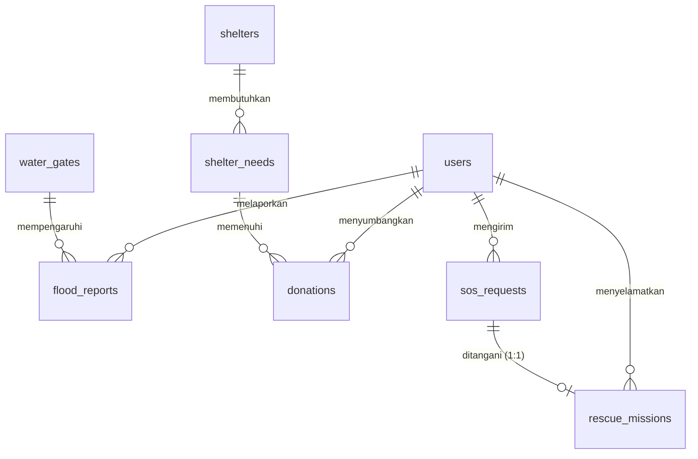

# 🗺️ Master Plan & Panduan AI-Assisted Developer - TitikAman

Dokumen ini adalah rencana komprehensif, panduan arsitektur, dan instruksi prompting AI untuk tim developer **TitikAman** (Sistem Mitigasi Banjir Kota Bekasi). Karena tim akan memanfaatkan AI dalam menulis kode, dokumen ini dirancang agar **langsung dipahami oleh developer manusia dan AI Coding Assistant** (seperti Gemini, Cursor, ChatGPT, atau Copilot).

---

## 👥 1. Struktur Tim & Pembagian Modul Kerja

Tim terdiri dari 5 orang dengan pembagian peran dan kepemilikan modul sebagai berikut:

* **Darell (Lead Developer & Project Manager)**: 
  - Penanggung jawab integrasi utama, keamanan, review PR, dan **Fase 5 (Portal Admin BPBD, TMA, & Peringatan Dini)**.
* **Innes (Developer 1 - Database & Auth Specialist)**:
  - Penanggung jawab **Fase 1 (Skema Database, Migrasi Alter, & Flow Autentikasi)**.
* **Fatur (Developer 2 - GIS & Citizen Portal Specialist)**:
  - Penanggung jawab **Fase 2 (Peta Leaflet.js, Laporan Banjir, & SOS)**.
* **Januar (Developer 3 - Real-Time & Relawan Portal Specialist)**:
  - Penanggung jawab **Fase 3 (Laravel Reverb, WebSockets, & Dashboard Relawan)**.
* **Jeffry (Developer 4 - Logistics & Donation Hub Specialist)**:
  - Penanggung jawab **Fase 4 (Logistik Posko & Hub Donasi Publik)**.

---

## 💾 2. Skema Database Terintegrasi (8 Tabel Utama + Alter Domisili)

Berdasarkan kesepakatan **Opsi A**, data domisili (`kecamatan` dan `kelurahan`) akan langsung disimpan ke dalam tabel `users` untuk mempermudah indexing dan query push notification peringatan dini.



### Kolom & Konvensi Tabel:
1. **`users`**: `user_id` (PK), `fullname`, `email` (nullable), `password`, `phone` (unique), `role` (enum: Warga, Relawan, Pengelola_Posko, Admin_BPBD), `kecamatan` (nullable), `kelurahan` (nullable), `timestamps`.
2. **`water_gates`**: `gate_id` (PK), `gate_name`, `river_name`, `water_level_cm`, `danger_status` (enum: Normal, Siaga_3, Siaga_2, Siaga_1), `last_updated`, `timestamps`.
3. **`flood_reports`**: `report_id` (PK), `user_id` (FK), `gate_id` (FK, nullable), `water_height_cm`, `street_name`, `latitude`, `longitude`, `photo_evidence` (nullable), `verification_status` (enum: pending, verified, rejected), `timestamps`, `soft_deletes`.
4. **`shelters`**: `shelter_id` (PK), `shelter_name`, `address`, `max_capacity`, `current_occupants`, `has_toilet_facilities` (enum: Yes, No), `status` (enum: active, full, closed), `latitude`, `longitude`, `timestamps`.
5. **`shelter_needs`**: `need_id` (PK), `shelter_id` (FK), `item_name`, `quantity_need`, `quantity_fulfilled`, `urgency` (enum: low, medium, high), `timestamps`.
6. **`donations`**: `donation_id` (PK), `donor_id` (FK), `need_id` (FK), `quantity_donated`, `shipping_receipt_no` (nullable), `proof_photo`, `status` (enum: pending, accepted, delivered), `donated_at`, `timestamps`, `soft_deletes`.
7. **`sos_requests`**: `sos_id` (PK), `user_id` (FK), `latitude`, `longitude`, `people_trapped`, `vulnerable_groups_count`, `priority_level` (enum: low, medium, high), `description` (nullable), `status` (enum: waiting, assigned, rescued, completed), `timestamps`, `soft_deletes`.
8. **`rescue_missions`**: `mission_id` (PK), `sos_id` (FK, unique), `volunteer_id` (FK), `assigned_at`, `resolved_at` (nullable), `timestamps`.

---

## 📅 3. Panduan Implementasi per Fase & AI Prompts

Setiap fase di bawah dilengkapi dengan **AI Prompt** khusus. Developer dapat menyalin prompt tersebut untuk diinput ke AI coding assistant mereka guna menghasilkan kode yang sesuai dengan standar proyek.

---

### 🌐 Fase 1: Fondasi, Layout Utama, & Flow Autentikasi
*   **Penanggung Jawab**: Innes (Developer 1 - DB & Auth Specialist)
*   **Sinkronisasi Figma**: Login (`211:271`), Register Step 1 (`82:156`), Register Warga (`82:329`)
*   **Aset Figma Lokal**: `logo-titikaman.png`, `watermark-shield.png`, `role-warga.svg`, `role-relawan.svg`, `role-pengelola.svg`, `role-admin.svg`, `input-email.svg`, `input-password.svg`, `eye-toggle.svg`, `arrow-right-submit.svg`, `bullet-check.svg`, `shield-security.svg`, `input-user.svg`, `input-phone.svg`, `info-verification.svg`, `chevron-down.svg`, `back-arrow.svg`, `next-arrow.svg`.

> [!IMPORTANT]
> **🤖 AI Prompt untuk Innes (Developer 1 - Copy-Paste ke AI Coder Anda):**
> ```text
> Saya adalah Innes, Developer 1 - Database & Auth Specialist. Saya sedang membangun proyek Laravel 12 bernama TitikAman tanpa Laravel Breeze.
> Tolong buatkan kode untuk Fase 1 Autentikasi dengan spesifikasi berikut:
> 1. Buat migration baru untuk menambahkan kolom `kecamatan` dan `kelurahan` (keduanya string, nullable) ke tabel `users` setelah kolom `role`.
> 2. Perbarui `$fillable` di model `User` agar menyertakan `kecamatan` dan `kelurahan`.
> 3. Buat `app/Http/Requests/RegisterRequest.php` untuk memvalidasi: fullname, phone (unique), email (nullable, unique), password (min 8), kecamatan, kelurahan, dan persetujuan syarat ketentuan.
> 4. Buat `AuthController` dengan method:
>    - `showLogin`: menampilkan view 'auth.login'
>    - `login`: menangani login menggunakan input ganda 'login_id' (bisa email atau nomor HP) dan 'password'.
>    - `showRegisterStep1`: menampilkan halaman pemilihan peran 'auth.register-step1'.
>    - `showRegisterStep2Warga`: menampilkan form pengisian data diri warga 'auth.register-step2-warga'.
>    - `registerWarga`: memproses input dari RegisterRequest, menyimpan user dengan role 'Warga', dan melakukan auto-login.
>    - `logout`: menghapus session dan logout.
> 5. Definisikan rute login, register.step1, register.step2.warga, dan logout di web.php menggunakan middleware guest/auth yang sesuai.
>
> Tulis kode yang rapi, modular, aman, dan patuhi konvensi penamaan Laravel.
> ```

---

### 🗺️ Fase 2: Portal Warga (SOS, Laporan Genangan, & Peta Evakuasi)
*   **Penanggung Jawab**: Fatur (Developer 2 - GIS & Citizen Portal Specialist)
*   **Sinkronisasi Figma**: Sinyal SOS (`190:2`), Form Lapor Banjir (`163:1375`), Peta Evakuasi (`174:2`)

> [!IMPORTANT]
> **🤖 AI Prompt untuk Fatur (Developer 2 - Copy-Paste ke AI Coder Anda):**
> ```text
> Saya adalah Fatur, Developer 2 - GIS & Citizen Portal Specialist. Saya sedang mengimplementasikan modul GIS dan Portal Warga di Laravel 12 menggunakan Leaflet.js (tanpa Tailwind/Breeze, gunakan CSS murni).
> Tolong buatkan komponen berikut dengan arsitektur Service-Repository:
> 1. Buat `SosRepository` dan `SosService` untuk menyimpan sinyal SOS ke tabel `sos_requests`. Level prioritas harus diset otomatis menjadi 'high' jika `vulnerable_groups_count` (lansia/balita/ibu hamil) lebih besar dari 0, dan 'low' jika 0.
> 2. Buat `FloodReportRepository` dan `FloodReportService` untuk menyimpan laporan warga ke tabel `flood_reports`. Laporan ini harus menampung upload foto genangan banjir (maksimal 5MB, format gambar). Buat validasi koordinat GPS di Form Request: latitude antara -90 dan 90, serta longitude antara -180 dan 180.
> 3. Buat rute-rute endpoint untuk Warga (role: Warga) di `web.php` di bawah prefix 'warga' dengan middleware auth.
> 4. Tulis file JS eksternal modular untuk inisialisasi peta Leaflet.js dengan basemap 'CartoDB Voyager'. Peta harus memetakan marker koordinat genangan terverifikasi (status: verified) dan posko pengungsian aktif.
>
> Pastikan controller tetap tipis (thin controller) dan semua logika penentuan prioritas dan upload file didelegasikan ke Service Class.
> ```

---

### 🚨 Fase 3: Portal Relawan (Misi Evakuasi & Koordinasi Real-Time)
*   **Penanggung Jawab**: Januar (Developer 3 - Real-Time & Relawan Specialist)
*   **Sinkronisasi Figma**: Dashboard Relawan (`163:2528`)

> [!IMPORTANT]
> **🤖 AI Prompt untuk Januar (Developer 3 - Copy-Paste ke AI Coder Anda):**
> ```text
> Saya adalah Januar, Developer 3 - Real-Time & Relawan Specialist. Saya sedang mengimplementasikan modul Relawan dan fitur Real-Time menggunakan Laravel Reverb dan WebSocket di Laravel 12.
> Tolong buatkan komponen berikut:
> 1. Buat `RescueMissionService` dan `RescueMissionRepository` untuk mengelola misi penyelamatan pada tabel `rescue_missions`.
> 2. Buat Event `SosDispatched` yang mengimplementasikan `ShouldBroadcast` agar data SOS baru langsung terkirim secara real-time via WebSocket ke channel `disaster.{kecamatan_slug}`.
> 3. Buat logic di Controller/Service di mana saat relawan menerima misi, status SOS di tabel `sos_requests` berubah menjadi 'assigned' dan ketika misi selesai berubah menjadi 'completed' dengan mengisi kolom `resolved_at`.
> 4. Buat halaman dashboard relawan yang menampilkan peta Leaflet.js berisi marker posisi korban SOS yang berstatus 'waiting'. Sediakan tombol "Terima Misi" dan "Evakuasi Selesai" yang melakukan pembaruan status via AJAX/Fetch API.
>
> Patuhi aturan AGENT.md: jangan gunakan emoji OS, gunakan Lucide Icons, dan pastikan listener WebSocket diinisialisasi dengan bersih.
> ```

---

### 📦 Fase 4: Portal Pengelola Posko & Donasi Hub (Logistik & Sanitasi)
*   **Penanggung Jawab**: Jeffry (Developer 4 - Logistics & Donation Specialist)
*   **Sinkronisasi Figma**: Kelola Kebutuhan (`163:2917`), Hub Donasi (`186:2`), Posko Pengungsian (`187:2`)

> [!IMPORTANT]
> **🤖 AI Prompt untuk Jeffry (Developer 4 - Copy-Paste ke AI Coder Anda):**
> ```text
> Saya adalah Jeffry, Developer 4 - Logistics & Donation Specialist. Saya sedang mengimplementasikan modul Logistik Posko dan Hub Donasi Publik di Laravel 12.
> Tolong buatkan komponen berikut:
> 1. Buat `ShelterService` untuk memperbarui jumlah pengungsi aktif (`current_occupants`) dan status posko (active, full, closed).
> 2. Buat `DonationService` untuk mengelola donasi barang logistik dari publik (tabel `donations`). Ketika donatur mengisi form kirim donasi, data bantuan disimpan berstatus 'pending'.
> 3. Buat Job `CompressDonationImageJob` yang didelegasikan ke Laravel queue untuk memproses dan mengompres foto bukti pengiriman donasi yang diunggah donatur sebelum disimpan ke storage.
> 4. Buat logic di mana saat pengelola posko memverifikasi bantuan fisik yang datang (mengubah status donasi menjadi 'delivered'), sistem otomatis menambahkan jumlah barang tersebut ke kolom `quantity_fulfilled` pada tabel `shelter_needs` yang berelasi.
>
> Tulis kode dengan menerapkan validasi Form Request yang ketat dan pisahkan logika donasi ke dalam service class yang modular.
> ```

---

### 📊 Fase 5: Portal Admin BPBD, Pemantauan TMA, & Dashboard Analitik
*   **Penanggung Jawab**: Darell (Lead Developer & PM)
*   **Sinkronisasi Figma**: Kelola Laporan Admin (`163:2189`), Data Pintu Air (`163:3941`)

> [!IMPORTANT]
> **🤖 AI Prompt untuk Darell (Copy-Paste ke AI Coder Anda):**
> ```text
> Saya adalah Darell, Lead Developer & PM. Saya sedang mengimplementasikan Portal Admin BPBD dan Manajemen Pintu Air di Laravel 12.
> Tolong buatkan komponen berikut:
> 1. Buat dashboard BPBD yang menampilkan statistik laporan genangan pending, verifikasi laporan genangan (mengubah status genangan warga dari 'pending' menjadi 'verified' atau 'rejected').
> 2. Buat fitur input Tinggi Muka Air (TMA) pintu air (tabel `water_gates`). Saat petugas memperbarui data TMA, jika status bahaya sungai melewati ambang batas (contoh: naik dari Siaga 3 ke Siaga 2/1), kirim peringatan dini secara otomatis.
> 3. Peringatan dini dijalankan via Laravel Event & Listener `TmaThresholdExceeded` yang akan men-dispatch background Job untuk mengirimkan push notification/SMS/WhatsApp broadcast kepada seluruh pengguna (warga) yang memiliki kecocokan domisili `kecamatan` atau `kelurahan` dengan aliran sungai pintu air tersebut.
> 4. Buat export data laporan banjir ke format Excel/PDF menggunakan Laravel Queue Job agar tidak membebani performa request.
>
> Pastikan sistem otorisasi menggunakan Policy/Gate Laravel sesuai role 'Admin_BPBD'.
> ```

---

## 📈 4. Standar Kualitas & Aturan Penulisan Kode (AI-Assisted Rules)

Semua developer dan AI Coding Assistant wajib mematuhi aturan berikut selama menulis kode program:

1.  **Arsitektur Service-Repository & Clean Code**:
    - **Controller** hanya bertugas menerima request, memanggil service, dan mengembalikan view/response (thin controller).
    - **Service Class** mengolah logika bisnis (misal: perhitungan prioritas, upload file, trigger event).
    - **Repository Class** mengolah interaksi database (Eloquent query, update, create).
    - **Pemisahan File (Modularization)**: Kode wajib bersih (Clean Code) dan terstruktur. Jika file (Controller, Service, Helper, dll.) dirasa sudah terlalu panjang atau memiliki banyak tanggung jawab (*violating Single Responsibility Principle*), **WAJIB** pecah kode tersebut ke dalam file terpisah (seperti membuat Service baru, kustom repository, helper class, atau trait).
2.  **Validasi Input**:
    - Dilarang keras menggunakan `$request->validate()` di dalam controller.
    - Seluruh form input wajib menggunakan **Form Request** terpisah (di bawah folder `app/Http/Requests`).
3.  **Aset Ikon & Font**:
    - **Dilarang** menggunakan emoji sistem operasi (misal: 🚨, 📡). Gunakan Lucide/Heroicons atau aset SVG resmi dari Figma yang telah disimpan di folder `public/assets/`.
    - Gunakan Google Fonts (Inter, Plus Jakarta Sans, Poppins) dalam tag HTML.
4.  **Keamanan Otorisasi**:
    - Cek hak akses menggunakan **Laravel Policy & Gate**. Jangan melakukan cek manual hard-code role di controller (`if (auth()->user()->role === 'admin')`).
5.  **Pengujian Otomatis (Testing) & Kebijakan Git**:
    - Setiap fitur baru wajib dilengkapi dengan Feature/Unit Test yang memvalidasi database dan alur program.
    - **DILARANG KERAS** melakukan `git push` ke GitHub apabila pengujian (test suite) belum berhasil lolos sepenuhnya (*pass*). Jalankan pengujian secara lokal terlebih dahulu sebelum push.
6.  **Konvensi Pesan Commit**:
    - Setiap commit wajib mematuhi panduan pesan commit yang tertuang pada **[docs/COMMIT_CONVENTION.md](file:///d:/laragon/www/titikAman/docs/COMMIT_CONVENTION.md)**. Pastikan tipe dan scope ditulis secara konsisten.
